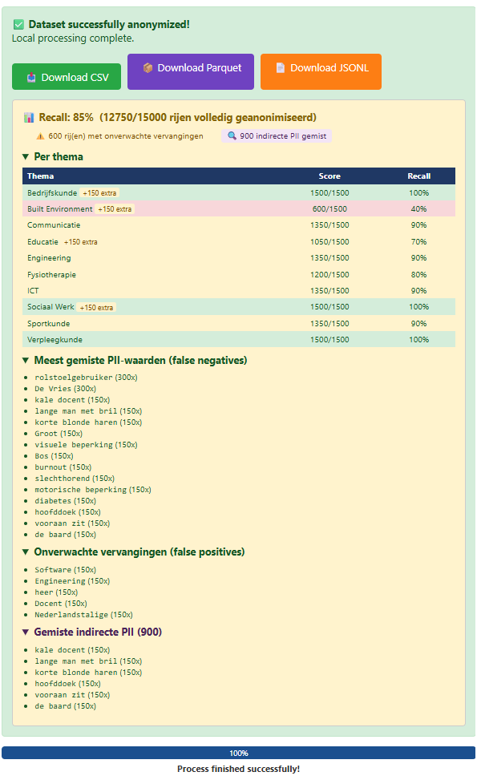
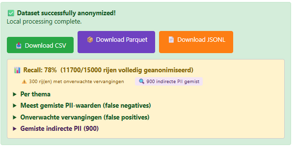
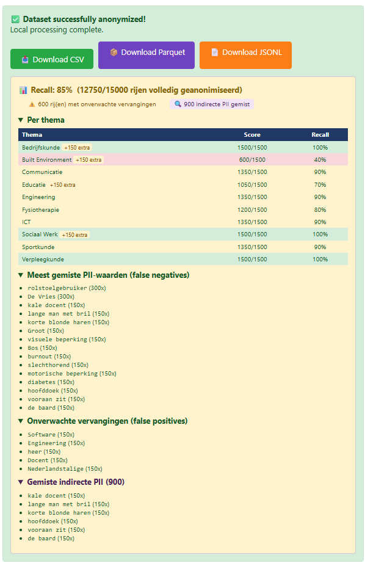
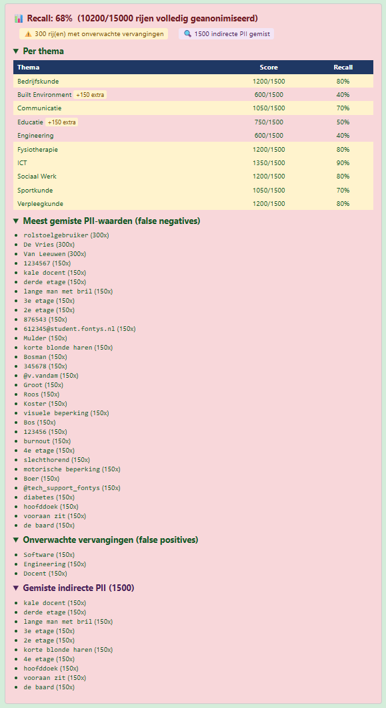
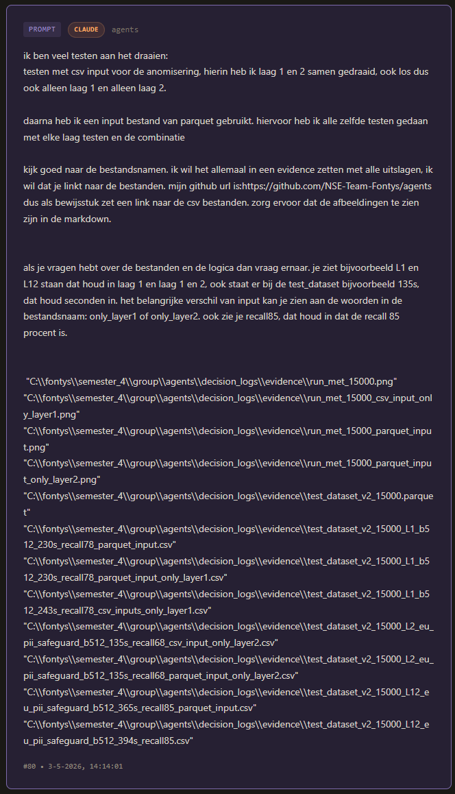

# Evidence: Laagbenchmark op 15.000 rijen — CSV vs Parquet inputformaat

**Datum:** 3 mei 2026  
**Dataset:** `test_dataset_v2_15000.parquet` / `test_dataset_v2_15000.csv` — 15.000 rijen, 10 thema's  
**Methode:** A/B-test (DOT Lab) — één variabele per run, zelfde dataset, batch size 512  
**Doel:** Valideren dat recall-resultaten uit de 100-rijen test standhouden op schaal, én dat inputformaat (CSV vs Parquet) geen invloed heeft op kwaliteit of verwerkingstijd.

---

## Dataset

**Brondataset:** [test_dataset_v2_15000.parquet](https://github.com/NSE-Team-Fontys/agents/blob/main/decision_logs/evidence/benchmark_15000/test_dataset_v2_15000.parquet) — 15.000 rijen, 10 thema's, synthetisch gegenereerd

---

## Runs — CSV input

| Lagen | Tijd | Recall | Volledig geanon. | Output |
|-------|------|--------|-----------------|--------|
| L1 only | 243s | **78%** | 11.700/15.000 | [↓ CSV](https://github.com/NSE-Team-Fontys/agents/blob/main/decision_logs/evidence/benchmark_15000/output/test_dataset_v2_15000_L1_b512_243s_recall78_csv_inputs_only_layer1.csv) |
| L2 only | 135s | **68%** | 10.200/15.000 | [↓ CSV](https://github.com/NSE-Team-Fontys/agents/blob/main/decision_logs/evidence/benchmark_15000/output/test_dataset_v2_15000_L2_eu_pii_safeguard_b512_135s_recall68_csv_input_only_layer2.csv) |
| L1+L2  | 394s | **85%** | 12.750/15.000 | [↓ CSV](https://github.com/NSE-Team-Fontys/agents/blob/main/decision_logs/evidence/benchmark_15000/output/test_dataset_v2_15000_L12_eu_pii_safeguard_b512_394s_recall85.csv) |

### Schermafbeeldingen — CSV

**L1+L2 (85% recall)**

**L1 only (78% recall)**

---

## Runs — Parquet input

| Lagen | Tijd | Recall | Volledig geanon. | Output |
|-------|------|--------|-----------------|--------|
| L1 only | 230s | **78%** | 11.700/15.000 | [↓ CSV](https://github.com/NSE-Team-Fontys/agents/blob/main/decision_logs/evidence/benchmark_15000/output/test_dataset_v2_15000_L1_b512_230s_recall78_parquet_input_only_layer1.csv) |
| L2 only | 135s | **68%** | 10.200/15.000 | [↓ CSV](https://github.com/NSE-Team-Fontys/agents/blob/main/decision_logs/evidence/benchmark_15000/output/test_dataset_v2_15000_L2_eu_pii_safeguard_b512_135s_recall68_parquet_input_only_layer2.csv) |
| L1+L2  | 365s | **85%** | 12.750/15.000 | [↓ CSV](https://github.com/NSE-Team-Fontys/agents/blob/main/decision_logs/evidence/benchmark_15000/output/test_dataset_v2_15000_L12_eu_pii_safeguard_b512_365s_recall85_parquet_input.csv) |

### Schermafbeeldingen — Parquet

**L1+L2 (85% recall)**

**L2 only (68% recall)**

---

## Bevinding 1 — Recall consistent op schaal

Dezelfde recall-percentages als bij de 100-rijen test (zie [`recall_meting_resultaten.md`](./recall_meting_resultaten.md)):

| Configuratie | 100 rijen | 15.000 rijen |
|---|---|---|
| L1 only | 78% | **78%** |
| L2 only | 68% | **68%** |
| L1+L2 | 85% | **85%** |

De pipeline schaalt lineair — kwaliteit degradeert niet bij grotere datasets.

---

## Bevinding 2 — Inputformaat heeft geen invloed op kwaliteit

CSV en Parquet leveren identieke recall-scores en dezelfde false negatives/positives (zie screenshots Run 3 vs Run 6: beide 12.750/15.000, zelfde false negatives lijst).

---

## Bevinding 3 — Timing consistent en licht sneller met Parquet

| Lagen | CSV | Parquet | Verschil |
|-------|-----|---------|---------|
| L1 only | 243s | 230s | −13s (−5%) |
| L2 only | 135s | 135s | 0s |
| L1+L2 | 394s | 365s | −29s (−7%) |

**Tijdconsistentie:** Run 4 (L1 + Parquet) is twee keer uitgevoerd met identieke output — beide keren 230s. Beide outputbestanden zijn bewaard:
- [test_dataset_v2_15000_L1_b512_230s_recall78_parquet_input.csv](https://github.com/NSE-Team-Fontys/agents/blob/main/decision_logs/evidence/benchmark_15000/output/test_dataset_v2_15000_L1_b512_230s_recall78_parquet_input.csv)
- [test_dataset_v2_15000_L1_b512_230s_recall78_parquet_input_only_layer1.csv](https://github.com/NSE-Team-Fontys/agents/blob/main/decision_logs/evidence/benchmark_15000/output/test_dataset_v2_15000_L1_b512_230s_recall78_parquet_input_only_layer1.csv)

Dezelfde tijd bij twee aparte runs bevestigt dat de meting reproduceerbaar is.

---

## Realisatie van dit bestand

Dit evidence bestand is aangemaakt op basis van de volgende opdracht aan Claude Code (screenshot van de prompt):

---

## DOT-framework verantwoording

**Methode: Lab — gecontroleerde A/B-test**

Zes runs met één variabele per stap (laag of inputformaat). Zelfde dataset, zelfde batch size (512), objectieve Python-check op recall. Output direct afgelezen uit UI en bestandsnaam.

**Beperking:** Testdata is synthetisch (geen echte studentfeedback). Absolute tijden zijn hardware-afhankelijk (NVIDIA GPU, 8GB VRAM). Recall-percentages zijn indicatief.
