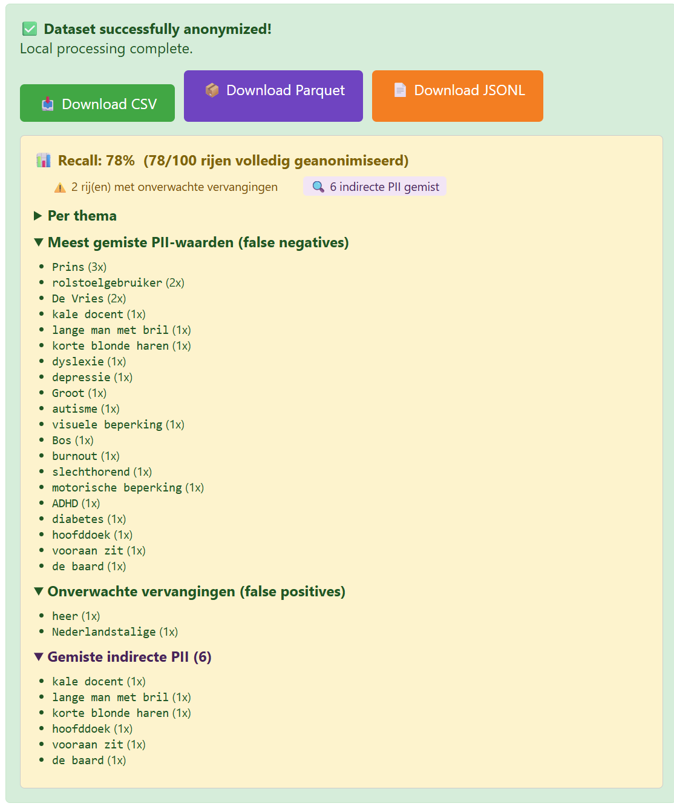
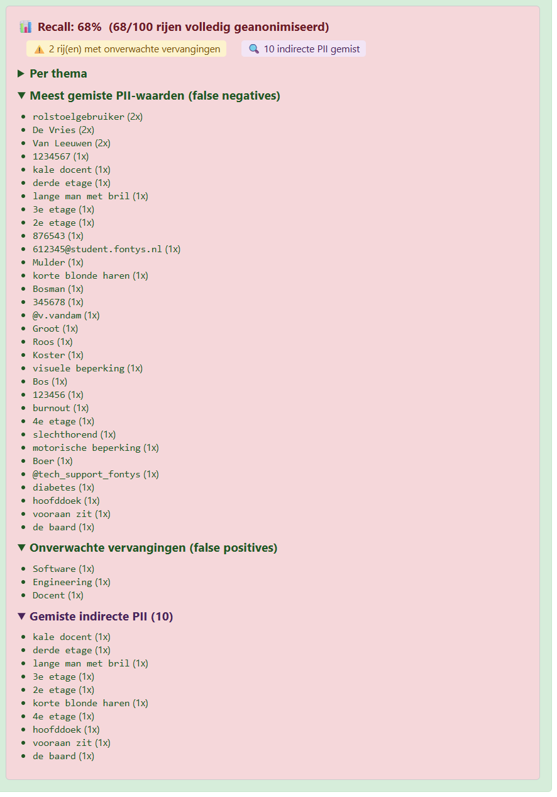
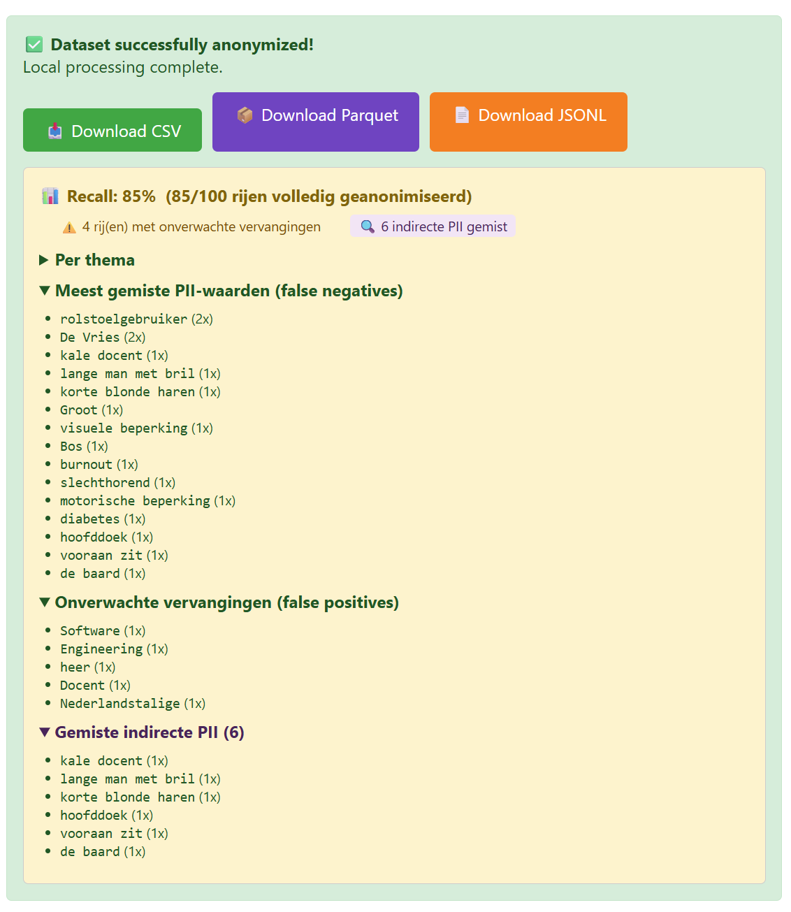
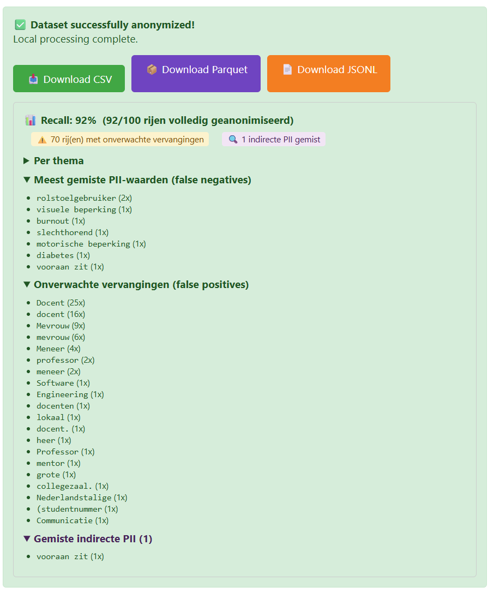

# Evidence: Recall Meting Resultaten — Laagvergelijking

**Datum:** 29 april 2026
**Dataset:** `test_dataset_v2.csv` — 100 rijen, 10 thema's, gelabeld met verwachte PII per rij
**Onderzoeksmethode:** A/B-test (DOT Lab) — één variabele gewijzigd per run, zelfde dataset, zelfde batch size (512)

---

## Testopzet

Vier runs uitgevoerd met identieke instellingen, alleen de actieve lagen wisselen:

| Run | Configuratie    | Model Layer 3 | Output bestand                                                            |
| --- | --------------- | ------------- | ------------------------------------------------------------------------- |
| A   | Layer 1 only    | —             | `test_dataset_v2_L1_b512_1s_recall78.csv`                                 |
| B   | Layer 2 only    | —             | *(screenshot)*                                                            |
| C   | Layer 1 + 2     | —             | `test_dataset_v2_L12_eu_pii_safeguard_b512_4s_recall85.csv`               |
| D   | Layer 1 + 2 + 3 | gemma4:e4b    | `test_dataset_v2_L123_eu_pii_safeguard_gemma4-e4b_b512_304s_recall92.csv` |

---

## Totaaloverzicht

| Configuratie | Recall | Volledig geanonimiseerd | Rijen met FP | Indirecte PII gemist | Verwerkingstijd |
|---|---|---|---|---|---|
| Layer 1 only | **78%** | 78/100 | 2 | 6 | **1s** |
| Layer 2 only | **68%** | 68/100 | 2 | 10 | — |
| Layer 1 + 2 | **85%** | 85/100 | 4 | 6 | **4s** |
| Layer 1 + 2 + 3 | **92%** | 92/100 | 70 | 1 | **304s** |

*Tijden afgelezen uit de outputbestandsnamen (`_1s_`, `_4s_`, `_304s_`).*

**Conclusie — tijd vs. kwaliteit:**
Layer 3 duurt **304x langer** dan Layer 1+2 (304s vs. 1s), haalt de recall op naar 92%, maar maskeert 70 rijen met woorden die geen PII zijn — "docent" (41x), "mevrouw" (15x), "collegezaal", "lokaal". Daardoor verliest de geanonimiseerde tekst context die nodig is om de feedback nog leesbaar en bruikbaar te maken. De recall-winst (+7%) weegt niet op tegen de contextschade.

Layer 1+2 is de beste balans: 85% recall, 4 FP-rijen, en 4 seconden verwerkingstijd.

---

## Screenshots UI-resultaten

### Run A — Layer 1 only (78%)

### Run B — Layer 2 only (68%)

### Run C — Layer 1 + 2 (85%)

### Run D — Layer 1 + 2 + 3 (92%)

---

## Gemiste PII (false negatives) per configuratie

### Layer 1 only
Prins (3x), rolstoelgebruiker (2x), De Vries (2x), kale docent (1x), lange man met bril (1x), korte blonde haren (1x), dyslexie (1x), depressie (1x), Groot (1x), autisme (1x), visuele beperking (1x), Bos (1x), burnout (1x), slechthorend (1x), motorische beperking (1x), ADHD (1x), diabetes (1x), hoofddoek (1x), vooraan zit (1x), de baard (1x)

### Layer 1 + 2
rolstoelgebruiker (2x), De Vries (2x), kale docent (1x), lange man met bril (1x), korte blonde haren (1x), Groot (1x), visuele beperking (1x), Bos (1x), burnout (1x), slechthorend (1x), motorische beperking (1x), diabetes (1x), hoofddoek (1x), vooraan zit (1x), de baard (1x)

*Layer 2 herstelt: Prins (3x), dyslexie, depressie, autisme, ADHD.*

### Layer 1 + 2 + 3
rolstoelgebruiker (2x), visuele beperking (1x), burnout (1x), slechthorend (1x), motorische beperking (1x), diabetes (1x), vooraan zit (1x)

*Layer 3 herstelt nog meer namen en gezondheidstermen — maar tegen een hoge FP-prijs (zie hieronder).*

---

## Onverwachte vervangingen (false positives) per configuratie

### Layer 1 only — 2 FP-rijen
heer (1x), Nederlandstalige (1x)

### Layer 1 + 2 — 4 FP-rijen
Software (1x), Engineering (1x), heer (1x), Docent (1x), Nederlandstalige (1x)

### Layer 1 + 2 + 3 — 70 FP-rijen
Docent (25x), docent (16x), Mevrouw (9x), mevrouw (6x), Meneer (4x), professor (2x), meneer (2x), Software (1x), Engineering (1x), docenten (1x), lokaal (1x), docent. (1x), heer (1x), Professor (1x), mentor (1x), grote (1x), collegezaal. (1x), Nederlandstalige (1x), (studentnummer (1x), Communicatie (1x)

Dit is precies de reden dat Layer 3 uitgeschakeld is als standaard (zie Decision Log #5). Het LLM maskeert generieke woorden als "docent", "mevrouw" en "collegezaal" die geen PII zijn.

---

## Indirecte PII — detail

| Configuratie | Indirecte PII gemist |
|---|---|
| Layer 1 only | 6 — kale docent, lange man met bril, korte blonde haren, hoofddoek, vooraan zit, de baard |
| Layer 2 only | 10 |
| Layer 1 + 2 | 6 — zelfde als Layer 1 only |
| Layer 1 + 2 + 3 | 1 — vooraan zit |

Layer 3 pakt bijna alle indirecte PII op, maar introduceert daarvoor 70 FP-rijen. Voor een dataset van 100 rijen is dat onacceptabel.

---

## DOT-framework verantwoording

**Methode: Lab — A/B-test**

Vier gecontroleerde runs met één variabele per stap (laagcombinatie). Zelfde dataset, zelfde batch size, objectieve Python-check (geen LLM-beoordeling). Resultaten direct uit de UI gehaald als screenshots en CSV-exports.

**Beperking:** De testdata is zelf gemaakt en niet afkomstig van echte studentfeedback. De absolute recall-cijfers zijn indicatief.
