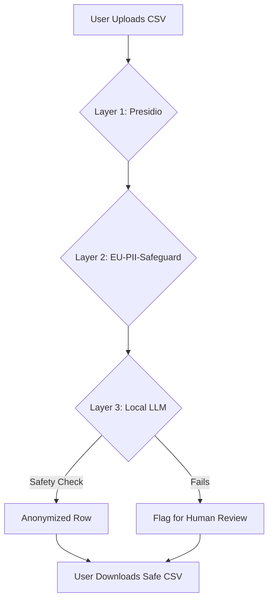

# Privacy Officer AI Agent

A robust, 100% offline, **triple-layer** anonymization tool designed to process open-text feedback (in Dutch and English). It ensures privacy-sensitive information is removed from datasets using a combination of fast regex, specialized transformer models, and a Large Language Model.

---

## 🏗️ Architecture & Tools Used

To balance **speed, deterministic accuracy, and contextual understanding**, this tool uses a triple-layer pipeline.

### Layer 1: Microsoft Presidio (Deterministic NER & Regex)
**What it is:** A fast, rule-based data protection engine.
**What it does:** It provides a first "coarse-grained" pass to instantly remove the most sensitive and structured data.
**It targets:** 
- **Identity:** Full names and surnames.
- **Contact:** Email addresses and Phone numbers.
- **Organization:** Fontys-specific Student Numbers (via custom regex) and employee numbers.
- **Locations:** Large geographic entities (Cities, Campuses).

### Layer 2: EU-PII-Safeguard (Specialized Transformer)
**What it is:** A specialized small transformer model (`tabularisai/eu-pii-safeguard`).
**What it does:** It acts as a safety net for standard named entities that regex might miss due to complex formatting or spelling variations.
**It targets:**
- **Named Entities:** Missed names and location mentions.
- **Structured PII:** Secondary validation for IDs and contact details.

### Layer 3: Ollama LLM (Contextual Understanding)
**What it is:** A local Large Language Model (default: `aya-expanse:8b`).
**What it does:** It performs a "fine-grained" contextual analysis to identify indirect PII—information that isn't a "name" but can still uniquely identify someone.
**It targets:**
- **Honorifics & Titles:** "Meneer de Vries", "Docent Janssen", "Prof. Davis".
- **Physical Descriptors:** Appearance, clothing, or unique physical traits (e.g., "rode jas", "kaal", "grote schoenen").
- **Institutional Context:** Specific courses, department names, or unique project groups.
- **Indirect IDs:** Mentions of specific schedules or unique personal situations.

### How it Works (Flowchart)



---

## 🚀 How to Run (Docker Setup)

This project is fully containerized using Docker. You do not need to install Python, pip dependencies, or configure your local environment manually.

### Prerequisites
1.  Install [Docker Desktop](https://www.docker.com/products/docker-desktop/).
2.  **Hardware**: NVIDIA GPU (recommended) for Layer 3. The `aya-expanse:8b` model uses ~5.2GB of VRAM.
3.  **Memory**: Allocate at least **8GB - 12GB of RAM** to Docker.

### Configuration (.env)
We use a central environment file to manage the AI model.
1. Check/create the `.env` file in the root folder.
2. Set your desired model:
   ```env
   OLLAMA_MODEL=aya-expanse:8b
   ```

### Starting the Project
1. Open your terminal or Command Prompt.
2. Navigate to the `privacy_officer` folder:
   ```bash
   cd path/to/privacy_officer
   ```
3. Run the Docker Compose command:
   ```bash
   docker-compose up --build
   ```

**What happens during startup?**
- **Docker builds the FastAPI server**: It installs all dependencies from [requirements.txt](requirements.txt). **Note**: The first build can take 5-10 minutes because it downloads heavy AI libraries like Spacy and Transformers.
- **Docker starts Ollama**: It initializes the local LLM engine.
- **Model Download**: An entrypoint script automatically pulls the model specified in your `.env` (e.g., `aya-expanse:8b`). This is a one-time download of several gigabytes.
- **Ready**: Once the model is loaded, the web UI becomes available at `http://localhost:8000`.

---

## 🖥️ Using the Web UI

We have built a user-friendly interface to process data without touching code.

1.  **Open the App**: Once Docker is running, go to `http://localhost:8000` in your web browser.
2.  **Upload**: Drag and drop your `.csv` file. Supports both **UTF-8** and **Latin-1** (Western European) encoding.
3.  **Specify Column**: Enter the exact name of the column containing the text you want to anonymize.
4.  **Configure Settings**: 
    - You will see a grid of checkboxes (Names, Locations, Titles, Courses, Physical Details, Student Numbers).
    - By default, everything is anonymized.
    - If you *uncheck* a box (e.g., "Locations"), the system dynamically tells Presidio and the LLM skip that category, keeping locations intact in the final output.
5.  **Process**: Click "Start Local Anonymization." A real-time progress bar will appear.
6.  **Human Review Warnings**: If the LLM failed to process a row (due to safety refusals or length mismatches), the UI will display a distinct **Orange Warning** telling you exactly how many rows need your manual review.

---

## ⚠️ Advanced: Manual Review Tags

If a row is too complex, or the LLM refuses to anonymize it due to safety constraints, the system will *not* delete the data. Instead, it flags the original row in the output CSV with a specific tag so a human Privacy Officer can easily search and fix it:

- `[NEEDS_REVIEW_LENGTH]`: The LLM output was suspiciously short or long (often a sign of hallucination or refusal).
- `[NEEDS_REVIEW_REFUSAL]`: The LLM output contained conversational text like "I cannot assist with this."
- `[NEEDS_REVIEW_LLM_FAIL]`: The LLM failed completely after multiple retries.
