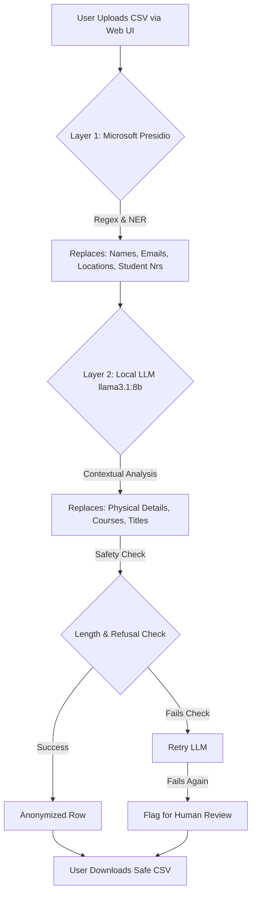

# Privacy Officer AI Agent

A robust, 100% offline, dual-layer anonymization tool designed to process open-text feedback (in Dutch and English) for educational institutions. It ensures privacy-sensitive information is removed from datasets before they are used for further analysis, without ever sending data to the cloud.

---

## 🏗️ Architecture & Tools Used

To balance **speed, deterministic accuracy, and contextual understanding**, this tool uses a dual-layer approach. It combines a fast, rule-based NLP tool with a smart, contextual Large Language Model.

### Layer 1: Microsoft Presidio (Deterministic NER & Regex)
**What it is:** An open-source data protection tool by Microsoft.
**What it does:** It scans text using Named Entity Recognition (NER) and Custom Regular Expressions to instantly find and replace structured data.
**It filters:** 
- Personal Names
- Locations (Cities, Campuses)
- Emails and Phone Numbers
- Fontys Student Numbers (Custom Regex mapping)

### Layer 2: Ollama LLM (Contextual Understanding)
**What it is:** A local engine running the `llama3.1:8b` Large Language Model.
**What it does:** It reads the text surrounding the words (the context) to find indirect identification that strict rules might miss.
**It filters:**
- Educational Courses or Departments
- Honorifics/Titles (e.g., "Meneer", "Prof.")
- Physical Descriptions (e.g., "blonde haren", "rode schoenen")

### How it Works (Flowchart)



---

## 🚀 How to Run (Docker Setup)

This project is fully containerized using Docker. You do not need to install Python, pip dependencies, or configure your local environment manually.

### Prerequisites
1. Install [Docker Desktop](https://www.docker.com/products/docker-desktop/).
2. Allocate sufficient memory to Docker. The `llama3.1:8b` model requires at least **8GB - 12GB of RAM** to run smoothly.

### Starting the Project
1. Open your terminal or Command Prompt.
2. Navigate to the `privacy_officer` folder:
   ```bash
   cd c:\fontys\semester_4\group\agents\privacy_officer
   ```
3. Run the Docker Compose command:
   ```bash
   docker-compose up --build
   ```

**What happens during startup?**
- Docker builds the FastAPI web server (`privacy-agent`).
- Docker starts the `ollama` container.
- An entrypoint script (`ollama_entrypoint.sh`) runs inside the Ollama container, automatically pulling and installing the `llama3.1:8b` model (this takes a few minutes the first time).
- Once the model is loaded, the FastAPI server becomes available.

---

## 🖥️ Using the Web UI

We have built a user-friendly interface to process data without touching code.

1.  **Open the App**: Once Docker is running, go to `http://localhost:8000` in your web browser.
2.  **Upload**: Drag and drop your `.csv` file.
3.  **Specify Column**: Enter the exact name of the column containing the text you want to anonymize (e.g., `feedback_text` or `OpenReactie`).
4.  **Configure Settings**: 
    - You will see a grid of checkboxes (Names, Locations, Titles, Courses, Physical Details, Student Numbers).
    - By default, everything is anonymized.
    - If you *uncheck* a box (e.g., "Locations"), the system dynamically tells Presidio and the LLM skip that category, keeping locations intact in the final output.
5.  **Process**: Click "Start Local Anonymization." A real-time progress bar will appear.
6.  **Human Review Warnings**: If the LLM failed to process a row (due to safety refusals or length mismatches), the UI will display a distinct **Orange Warning** telling you exactly how many rows need your manual review.

---

## ⚠️ Advanced: Manual Review Tags

If a row is too complex, or the LLM refuses to anonymize it due to safety constraints, the system will *not* delete the data. Instead, it flags the original row in the output CSV with a specific tag so a human Privacy Officer can easily search and fix it:

- `[NEEDS_REVIEW_LENGTH]`: The LLM output was suspiciously short or long (often a sign of hallucination or refusal).
- `[NEEDS_REVIEW_REFUSAL]`: The LLM output contained conversational text like "I cannot assist with this."
- `[NEEDS_REVIEW_LLM_FAIL]`: The LLM failed completely after multiple retries.
