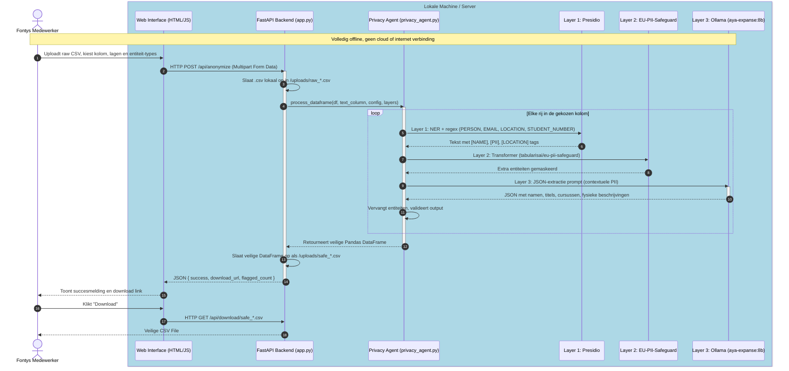
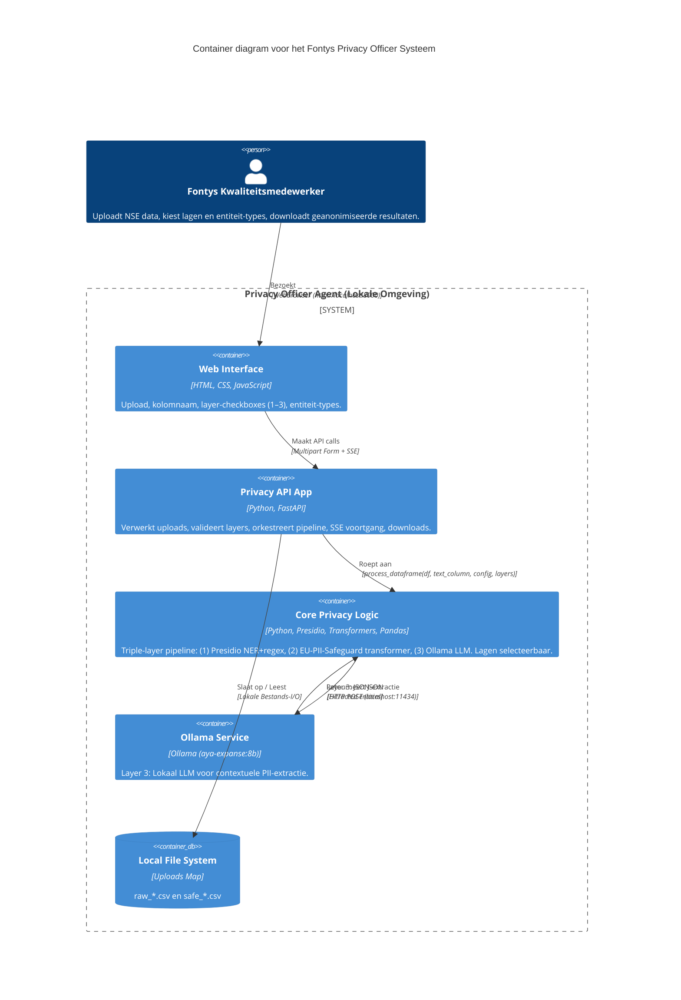
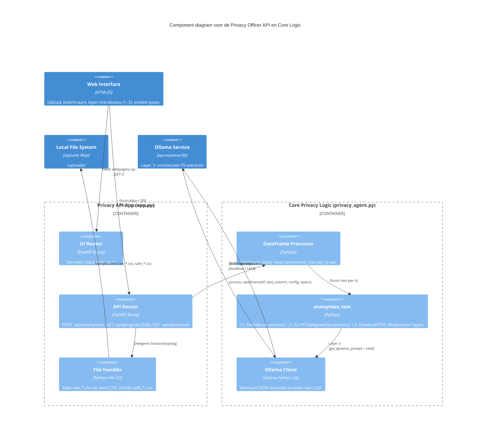

# 🏗️ Fontys Privacy Officer Agent - Architecture Diagram

Dit diagram toont de stroom van data en communicatie tussen alle componenten van de Privacy Officer applicatie. Dit is ideaal om aan de IT-architect van Fontys te laten zien, zodat zij direct begrijpen dat **alles lokaal blijft** en de NDA gewaarborgd is.

Je kunt de onderstaande Mermaid-code kopiëren en in een tool zoals [Mermaid Live Editor](https://mermaid.live/) of in jullie eigen documentatie plakken.

### 🧩 Componenten Uitleg:
1. **Web Interface (HTML/JS)**: De gebruiksvriendelijke "voorkant" die in de browser draait. Bevat checkboxes voor lagen (1–3) en entiteit-types (namen, locaties, PII, titels, etc.).
2. **FastAPI Backend** ([privacy_officer/src/api/app.py](privacy_officer/src/api/app.py)): Ontvangt het bestand, valideert layer-selectie, roept de core aan, en regelt downloads. Biedt SSE voor real-time voortgang.
3. **Privacy Agent** ([privacy_officer/src/core/privacy_agent.py](privacy_officer/src/core/privacy_agent.py)): Triple-layer pipeline. Layer 1: Presidio (regex/NER). Layer 2: EU-PII-Safeguard (transformer). Layer 3: Ollama LLM (contextueel). Lagen zijn selecteerbaar via de UI.
4. **Ollama Service**: Lokaal AI-model (standaard `aya-expanse:8b`). Luistert op poort `11434`. Omdat het **niet** in de cloud draait, lekt er geen data.

---

## 🏛️ C4 Container Diagram

Dit is een Niveau 2 (Container) C4-diagram dat perfect aantoont hoe de systemen van elkaar geïsoleerd zijn. De grijze rand ("System_Boundary") maakt direct duidelijk dat de hele oplossing binnen de beveiligde IT-infrastructuur van Fontys kan draaien.

---

## 🧩 C4 Component Diagram (Level 3)

Dit is een Niveau 3 (Component) C4-diagram dat inzoomt in de "Privacy API App" en "Core Privacy Logic" containers om te laten zien hoe de Python code intern in elkaar steekt. Dit is nuttig voor developers om te begrijpen hoe applicatie componenten samenwerken.

